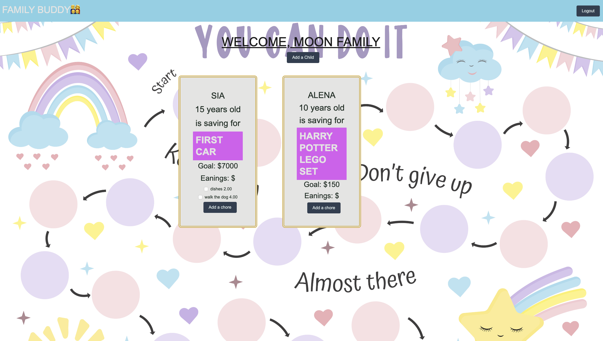
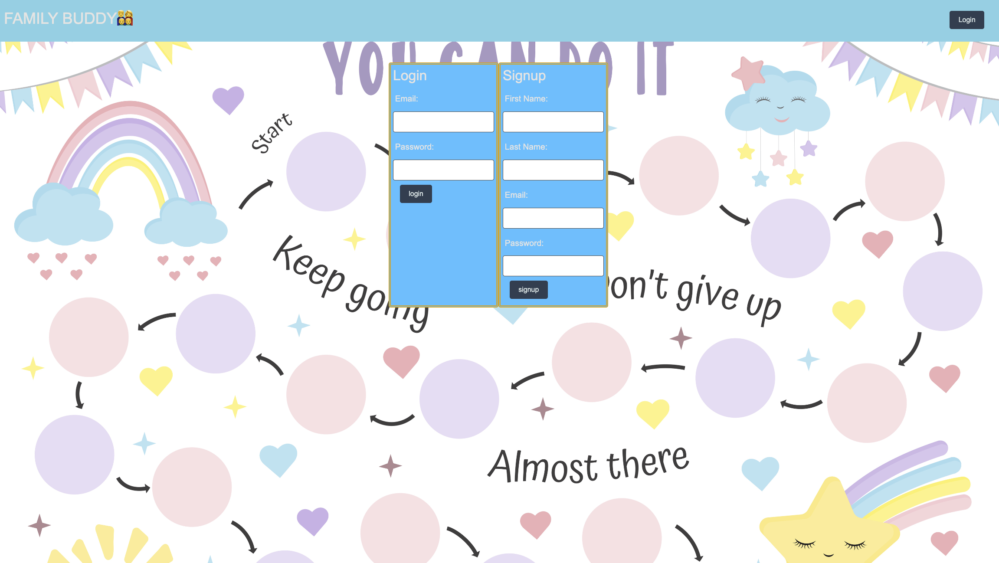

# Family-buddy

## Description
     
* Family-buddy is a family chore organizer application. This application is for parent and children. The application helps parent motivate and manage children chores, and helps children track their progress towards the goal by completing chores and have a visualisation of the progress. 

* _What motivated us to do this project? We wanted a well designed tool to use with our family.

* _Why did I build this application?_ We wanted an application to motivate kids to do chores. This application helps children set a goal like a new toy and visually see where he or she is in the process of reaching the goal. Visual presentation makes it exciting and helps a child understand that reaching a goal is not impossible. 

* _What did I learn?_  We learned how to build a SQL database, work with both front end and back end, use handlebars template. 

* _What problem does my application solve?_ The application teaches kids how to set goals and works towards them. 
      

## Table of Contents
    
1. [Installation](#installation)
1. [Usage](#usage)
1. [License](#license)
1. [Contributing](#contributing)
1. [Tests](#tests)
1. [Questions](#tests)

## Installation
Type http://family-buddy-b8560051fa5f.herokuapp.com/ in the brower to open the application. Create a username if you are a new user, or log in if you are an existing user. 

## Usage
Once logged in, click "Add a child" to create child record and a child's goal. Click "Add chore" to add a chore and the price.
## License
None
## Contributing
Our tutor Doug helped overcome the challenge of save button in add chore modal throwing error and saving a chore to a child. 
- https://preply.com/en/tutor/3316660
## Tests
You can test this application going to http://family-buddy-b8560051fa5f.herokuapp.com/ and creating a user account. 
## Questions
You can see our GitHub accounts here:
>[Anna](https://github.com/Four-Moons-Tech)
>[Jarett](https://github.com/JarettDeSanti)
>[Chukwuka](https://github.com/Kendrink)

>You can contact us via email with any questions:
>Anna:  anna@fourmoonstech.com
>Jarett: jarettdesanti@gmail.com
>Chukwuka: chukwukaizamojee@gmail.com

> Heroku Deployment: https://family-buddy-b8560051fa5f.herokuapp.com/add_child
>

>
> 